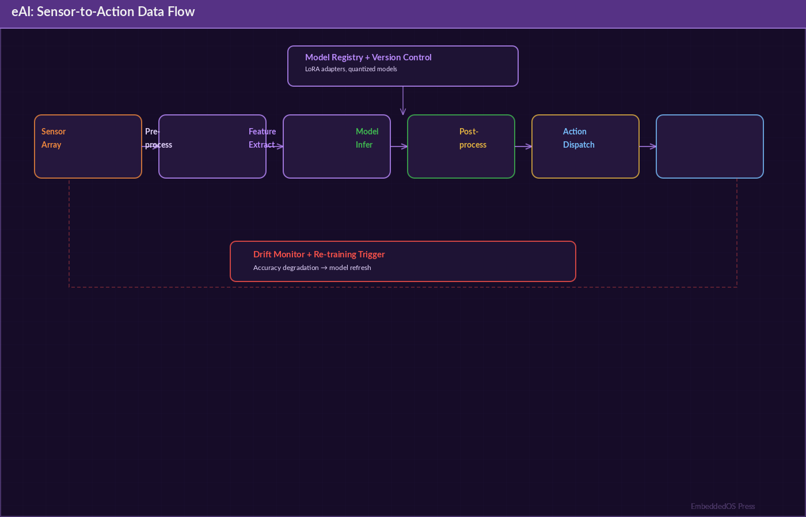
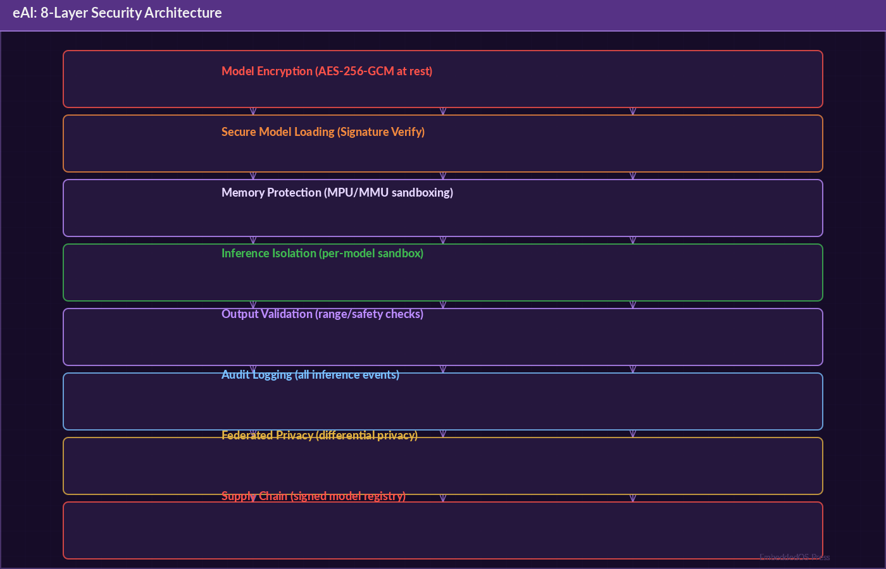

# eAI: The Definitive Reference Guide

## Embedded AI Framework

**Version 0.1.0**

**Srikanth Patchava & EmbeddedOS Contributors**

**April 2026**

---

*A comprehensive technical reference for the eAI embedded AI framework — high-performance on-device AI for embedded systems, edge [@deng2020] devices, and intelligent machines.*

*Published by the EmbeddedOS Project*
*Copyright (c) 2026 EoS Project. MIT License.*

---

## Preface


eAI is a C11 embedded AI framework that brings LLM inference, autonomous agents, and adaptive learning directly to resource-constrained devices — from microcontrollers to edge servers. It runs entirely on-device with zero cloud dependency, while supporting optional hybrid connectivity.

eAI is designed for systems where latency matters, connectivity is unreliable, and safety is non-negotiable: robotics, industrial automation, smart cameras, medical devices, autonomous vehicles, and IoT gateways.

This reference guide covers the complete eAI framework: the two-tier architecture (EAI-Min and EAI-Framework), model formats and the EAIM model registry, the inference pipeline, the 8-layer security architecture including secure boot for models, BCI integration via eIPC, TFLite [@tflite_micro] Micro and llama.cpp backends, on-device LLM inference, adaptive learning, federated [@mcmahan2017] learning, and the full API reference for all 37+ modules.

### Who This Book Is For

- **Embedded AI Engineers** deploying models on resource-constrained devices
- **Robotics Engineers** building autonomous agents on edge hardware
- **IoT Developers** adding AI capabilities to connected devices
- **Security Engineers** evaluating the AI safety and security architecture
- **ML Engineers** optimizing models for embedded deployment

### How This Book Is Organized

- **Part I: Foundations** — Architecture, design principles, and two-tier system
- **Part II: EAI-Min** — Lightweight runtime for MCUs and edge devices
- **Part III: EAI-Framework** — Enterprise platform for edge servers
- **Part IV: Models and Inference** — Model registry, quantiz [@jacob2018]ation, inference pipeline
- **Part V: Security** — 8-layer defense architecture, secure boot, guardrails
- **Part VI: Advanced Topics** — Adaptive learning, federated learning, BCI integration
- **Part VII: Reference** — Complete API, CLI, configuration, troubleshooting

---

## Table of Contents

- [Part I: Foundations](#part-i-foundations)
  - [Chapter 1: Introduction to eAI](#chapter-1-introduction-to-eai)
  - [Chapter 2: Two-Tier Architecture](#chapter-2-two-tier-architecture)
  - [Chapter 3: Design Principles](#chapter-3-design-principles)
- [Part II: EAI-Min Lightweight Runtime](#part-ii-eai-min-lightweight-runtime)
  - [Chapter 4: EAI-Min Overview](#chapter-4-eai-min-overview)
  - [Chapter 5: Runtime and Inference](#chapter-5-runtime-and-inference)
  - [Chapter 6: Agent Framework](#chapter-6-agent-framework)
  - [Chapter 7: Sensor Management](#chapter-7-sensor-management)
  - [Chapter 8: Power-Aware Inference](#chapter-8-power-aware-inference)
- [Part III: EAI-Framework Enterprise Platform](#part-iii-eai-framework-enterprise-platform)
  - [Chapter 9: EAI-Framework Overview](#chapter-9-eai-framework-overview)
  - [Chapter 10: Runtime Manager](#chapter-10-runtime-manager)
  - [Chapter 11: Orchestrator and Workflows](#chapter-11-orchestrator-and-workflows)
  - [Chapter 12: Industrial Connectors](#chapter-12-industrial-connectors)
  - [Chapter 13: Sensor Fusion](#chapter-13-sensor-fusion)
- [Part IV: Models and Inference](#part-iv-models-and-inference)
  - [Chapter 14: Model Registry](#chapter-14-model-registry)
  - [Chapter 15: Quantization and Optimization](#chapter-15-quantization-and-optimization)
  - [Chapter 16: Inference Pipeline](#chapter-16-inference-pipeline)
  - [Chapter 17: Backend Integration](#chapter-17-backend-integration)
- [Part V: Security](#part-v-security)
  - [Chapter 18: 8-Layer Security Architecture](#chapter-18-8-layer-security-architecture)
  - [Chapter 19: Secure Boot for Models](#chapter-19-secure-boot-for-models)
  - [Chapter 20: AI Safety and Guardrails](#chapter-20-ai-safety-and-guardrails)
  - [Chapter 21: Supply Chain Security](#chapter-21-supply-chain-security)
- [Part VI: Advanced Topics](#part-vi-advanced-topics)
  - [Chapter 22: Adaptive Learning and LoRA [@hu2021]](#chapter-22-adaptive-learning-and-lora)
  - [Chapter 23: Federated Learning](#chapter-23-federated-learning)
  - [Chapter 24: BCI Integration via eIPC](#chapter-24-bci-integration-via-eipc)
  - [Chapter 25: Deployment Profiles](#chapter-25-deployment-profiles)
- [Part VII: Reference](#part-vii-reference)
  - [Chapter 26: Complete API Reference](#chapter-26-complete-api-reference)
  - [Chapter 27: CLI Reference](#chapter-27-cli-reference)
  - [Chapter 28: Build System](#chapter-28-build-system)
  - [Chapter 29: Troubleshooting](#chapter-29-troubleshooting)
- [Appendix A: Glossary](#appendix-a-glossary)
- [Appendix B: Model Compatibility Matrix](#appendix-b-model-compatibility-matrix)
- [Appendix C: Related Projects](#appendix-c-related-projects)

---

# Part I: Foundations

---

## Chapter 1: Introduction to eAI

### 1.1 What Is eAI?

eAI is a C11 embedded AI framework that brings LLM inference, autonomous agents, and adaptive learning directly to resource-constrained devices. It runs entirely on-device with zero cloud dependency, while supporting optional hybrid connectivity.

### 1.2 Key Design Principles

- **Offline-first**: Full autonomy without cloud connectivity
- **Resource-aware**: Quantized models, power-aware scheduling, memory-conscious design
- **Security by default**: 8-layer defense architecture from boot to runtime
- **Two-tier architecture**: Choose the right footprint for your hardware

### 1.3 Target Use Cases

| Domain | Example |
|---|---|
| Robotics | Autonomous navigation, obstacle avoidance |
| Industrial automation | Predictive maintenance, anomaly detection |
| Smart cameras | Object detection, face recognition |
| Medical devices | Real-time patient monitoring |
| Autonomous vehicles | Sensor fusion, decision making |
| IoT gateways | Edge inference, data filtering |

### 1.4 Quick Start

```bash
mkdir build && cd build

# Lightweight only
cmake .. -DEAI_BUILD_FRAMEWORK=OFF
make

# Full enterprise platform
cmake .. -DEAI_BUILD_MIN=ON -DEAI_BUILD_FRAMEWORK=ON
make

# With llama.cpp backend
cmake .. -DEAI_LLAMA_CPP=ON -Dllama_DIR=/path/to/llama.cpp/lib/cmake/llama
make

# With tests
cmake .. -DEAI_BUILD_TESTS=ON
make && ctest
```

---

## Chapter 2: Two-Tier Architecture

### 2.1 Overview


eAI ships as two distinct product tiers sharing a common foundation:

```
+----------------------------------------------+
|              Common Foundation                |
| Types, Config, Logging, Security, Tools,      |
| Manifest, Adaptive, Runtime Contract, EIPC    |
+----------------------------------------------+
        |                        |
        v                        v
+------------------+    +-------------------+
|    EAI-Min       |    |   EAI-Framework   |
|  (Lightweight)   |    |   (Enterprise)    |
|  ~50KB RAM       |    |   512MB+ RAM      |
|  10 modules      |    |   17 modules      |
|  MCUs, SBCs      |    |   Edge servers    |
+------------------+    +-------------------+
```

### 2.2 EAI-Min - Lightweight Runtime

For MCUs, SBCs, and battery-powered edge devices (Cortex-M7, RPi, nRF5340).

| Module | Description |
|---|---|
| **Runtime** | Single-backend inference engine (llama.cpp, ONNX, TFLite) |
| **Agent** | ReAct-style think-act-observe loop with tool calling |
| **Router** | Local/cloud/auto inference routing |
| **Memory Lite** | 128-entry key-value store with LRU eviction |
| **Security Lite** | Audit logging, prompt injection detection, boot verification |
| **Observability Lite** | Health counters, latency tracking, system monitoring |
| **Sensor** | 32-sensor registry with calibration and moving-average filter |
| **OTA Update** | Secure model updates with hash verification and rollback |
| **Compression** | Quantization recommender and model size estimation |
| **Power Manager** | Battery-aware inference throttling and thermal management |

Static footprint: ~50KB RAM. Targets: 80MB-2GB devices.

### 2.3 EAI-Framework - Enterprise Platform

For edge servers, industrial gateways, and high-performance embedded systems (Jetson, x86, i.MX8M). Includes everything in EAI-Min plus:

| Module | Description |
|---|---|
| **Runtime Manager** | Pool of 8 concurrent inference backends with hot-switching |
| **Orchestrator** | DAG-style workflow engine with 9 step types and branching |
| **Connectors** | MQTT, OPC-UA, Modbus TCP, CAN bus protocol abstraction |
| **Memory** | 1024-entry namespaced KV store with TTL, GC, and persistence |
| **Policy Engine** | Subject/resource/operation ACL with wildcards and audit mode |
| **Observability** | Counters, gauges, histograms, distributed trace spans |
| **Adaptive Engine** | On-device LoRA fine-tuning with feedback-to-training pipeline |
| **Federated Learning** | Multi-device FedAvg with differential privacy |
| **Update Manager** | A/B partition OTA with rollback, maintenance windows |
| **Secure Boot** | 4-stage boot chain verification, key management, attestation |
| **Supply Chain** | SBOM management, vendor trust levels, license compliance |
| **Sensor Fusion** | Weighted average, Kalman filter, voting - up to 8 groups |
| **Network Security** | TLS/mTLS, certificate management, key rotation |
| **Guardrails** | AI output safety - injection blocking, rate limiting, kill switch |

Targets: 512MB-16GB+ devices with multi-protocol connectivity.

---

## Chapter 3: Design Principles

### 3.1 Embedded Constraints

Embedded systems are resource-limited. eAI addresses this through:

1. **Zero dynamic allocation in critical paths** - Static buffers, pre-allocated pools
2. **Configurable memory budgets** - Each module has compile-time size limits
3. **Power-aware scheduling** - Inference throttling based on battery and thermal state
4. **Quantized models** - 4-bit to 32-bit precision with quality/size tradeoffs

### 3.2 C11 Standard

eAI is written in C11 for maximum portability across embedded platforms. No C++ features are used in the core library, ensuring compatibility with constrained toolchains.

### 3.3 Platform Abstraction

```
eAI/
  platform/                # OS abstraction layer
    linux/                 # Linux implementation
    windows/               # Windows implementation
    eos/                   # EoS implementation
    baremetal/              # Bare-metal stubs
```

---

# Part II: EAI-Min Lightweight Runtime

---

## Chapter 4: EAI-Min Overview

### 4.1 Module Architecture

```
eAI-Min
  +-- Runtime           Single-backend inference
  +-- Agent              Think-act-observe loop
  +-- Router             Local/cloud routing
  +-- Memory Lite        128-entry KV store
  +-- Security Lite      Audit + injection detection
  +-- Observability Lite Counters + latency
  +-- Sensor             32-sensor registry
  +-- OTA Update         Hash-verified updates
  +-- Compression        Quantization recommender
  +-- Power Manager      Battery/thermal-aware
```

### 4.2 Complete Example

```c
#include "eai_min/eai_min.h"

int main(void) {
    // Initialize runtime
    eai_min_runtime_t runtime;
    eai_min_runtime_create(&runtime, EAI_RUNTIME_LLAMA_CPP);
    eai_min_runtime_load(&runtime, "phi-3-mini-q4.gguf", NULL);

    // Initialize power-aware inference
    eai_min_power_t power;
    eai_min_power_init(&power, NULL);
    eai_min_power_set_battery(&power, 75.0f, EAI_POWER_BATTERY);

    // Setup security
    eai_min_security_lite_t sec;
    eai_security_ctx_t ctx;
    eai_security_ctx_init(&ctx, "edge-device-001");
    eai_min_sec_init(&sec, &ctx);
    eai_min_sec_verify_boot(&sec);

    // Run agent
    eai_min_agent_t agent;
    eai_min_agent_init(&agent, &runtime, NULL, NULL);

    eai_agent_task_t task = {
        .goal = "Monitor temperature and report anomalies",
        .max_iterations = 5
    };
    eai_min_agent_run(&agent, &task);

    printf("Result: %s\n", eai_min_agent_output(&agent));

    eai_min_runtime_destroy(&runtime);
    return 0;
}
```

---

## Chapter 5: Runtime and Inference

### 5.1 Runtime API

```c
// Create runtime with specific backend
eai_min_runtime_t runtime;
eai_min_runtime_create(&runtime, EAI_RUNTIME_LLAMA_CPP);

// Load a model
eai_min_runtime_load(&runtime, "model.gguf", NULL);

// Run inference
const char *prompt = "Analyze sensor reading: temp=85.3C";
char output[4096];
eai_min_runtime_infer(&runtime, prompt, output, sizeof(output));

// Cleanup
eai_min_runtime_destroy(&runtime);
```

### 5.2 Backend Types

| Backend | Constant | Use Case |
|---|---|---|
| Stub | `EAI_RUNTIME_STUB` | Testing, development |
| llama.cpp | `EAI_RUNTIME_LLAMA_CPP` | LLM inference (GGUF models) |
| TFLite Micro | `EAI_RUNTIME_TFLITE` | TensorFlow Lite models |
| ONNX | `EAI_RUNTIME_ONNX` | ONNX models |

### 5.3 Inference Router

The router decides where to run inference:

```c
eai_min_router_t router;
eai_min_router_init(&router, EAI_ROUTE_LOCAL);

// Routing modes:
// EAI_ROUTE_LOCAL  - Always run locally
// EAI_ROUTE_CLOUD  - Always forward to cloud
// EAI_ROUTE_AUTO   - Decide based on model size and connectivity
```

---

## Chapter 6: Agent Framework

### 6.1 ReAct Agent

The agent implements a ReAct-style think-act-observe loop:

```
Think: Analyze the situation
  |
  v
Act: Call a tool (CALL: protocol)
  |
  v
Observe: Process tool result
  |
  v
Repeat until goal is met or max iterations
```

### 6.2 Agent API

```c
eai_min_agent_t agent;
eai_min_agent_init(&agent, &runtime, tools, tool_count);

eai_agent_task_t task = {
    .goal = "Monitor temperature and alert if above 80C",
    .max_iterations = 10
};

eai_min_agent_run(&agent, &task);
const char *result = eai_min_agent_output(&agent);
```

### 6.3 Tool Registry

```c
// Register tools for the agent
eai_tool_t tools[] = {
    {.name = "read_sensor", .fn = sensor_read_handler},
    {.name = "send_alert",  .fn = alert_handler},
    {.name = "set_actuator", .fn = actuator_handler},
};

// Built-in tools (7):
// mqtt_publish, sensor_read, http_request, preference_get,
// preference_set, feedback_submit, model_info
```

---

## Chapter 7: Sensor Management

### 7.1 Sensor Registry




```c
eai_min_sensor_t sensors;
eai_min_sensor_init(&sensors);

// Register a sensor
eai_min_sensor_register(&sensors, "temp_1", EAI_SENSOR_TEMPERATURE);

// Add calibration
eai_min_sensor_calibrate(&sensors, "temp_1", 0.98f, -0.5f);  // scale, offset

// Read with filtering (moving average)
float value = eai_min_sensor_read(&sensors, "temp_1");
```

### 7.2 Sensor Types

| Type | Constant | Unit |
|---|---|---|
| Temperature | `EAI_SENSOR_TEMPERATURE` | Celsius |
| Humidity | `EAI_SENSOR_HUMIDITY` | % RH |
| Pressure | `EAI_SENSOR_PRESSURE` | hPa |
| Accelerometer | `EAI_SENSOR_ACCEL` | m/s^2 |
| Gyroscope | `EAI_SENSOR_GYRO` | deg/s |
| Current | `EAI_SENSOR_CURRENT` | mA |
| Voltage | `EAI_SENSOR_VOLTAGE` | V |

---

## Chapter 8: Power-Aware Inference

### 8.1 Power Manager

```c
eai_min_power_t power;
eai_min_power_init(&power, NULL);

// Set battery state
eai_min_power_set_battery(&power, 45.0f, EAI_POWER_BATTERY);

// Get recommended inference parameters
eai_power_params_t params = eai_min_power_get_params(&power);
// params.max_tokens, params.temperature, params.budget
```

### 8.2 Power States

| Power State | Max Tokens | Temperature | Inference Budget |
|---|---|---|---|
| FULL_POWER | 256 | 0.7 | Unlimited |
| ECO | 128 | 0.5 | 1,000 |
| LOW_POWER | 64 | 0.3 | 100 |
| CRITICAL | 32 | 0.1 | 10 |

### 8.3 Thermal Management

The power manager monitors device temperature and throttles inference to prevent overheating:

```c
eai_min_power_set_thermal(&power, 72.5f);  // Current temp in Celsius
// Automatically reduces inference if temp > 80C
// Emergency shutdown if temp > 95C
```

---

# Part III: EAI-Framework Enterprise Platform

---

## Chapter 9: EAI-Framework Overview

### 9.1 Complete Example

```c
#include "eai_fw/eai_framework.h"

int main(void) {
    // Runtime manager with multiple backends
    eai_fw_runtime_manager_t rtmgr;
    eai_fw_rtmgr_init(&rtmgr);

    // Security: boot chain + guardrails
    eai_fw_secure_boot_t secboot;
    eai_fw_secboot_init(&secboot);
    eai_fw_secboot_add_chain_entry(&secboot, EAI_BOOT_STAGE_BOOTLOADER,
                                    "bootloader", "sha256:abc123...");
    eai_fw_secboot_verify_chain(&secboot);

    eai_fw_guardrails_t guardrails;
    eai_fw_guard_init(&guardrails);

    // Supply chain verification
    eai_fw_supply_chain_t sbom;
    eai_fw_sc_init(&sbom, "eAI", "0.1.0");
    eai_fw_sc_add_component(&sbom, "llama.cpp", "b3600",
                             "ggerganov", "sha256:...", EAI_LICENSE_MIT);
    eai_fw_sc_verify_all(&sbom);

    // Network security for connectors
    eai_fw_network_security_t netsec;
    eai_fw_netsec_init(&netsec, NULL);

    // Sensor fusion
    eai_fw_sensor_fusion_t fusion;
    eai_fw_fusion_init(&fusion);
    eai_fw_fusion_create_group(&fusion, "temperature", EAI_FUSION_KALMAN);

    // Federated learning
    eai_fw_federated_t fed;
    eai_fw_fed_init(&fed, EAI_FED_COORDINATOR, NULL);
    eai_fw_fed_add_participant(&fed, "device-001");
    eai_fw_fed_add_participant(&fed, "device-002");

    eai_fw_rtmgr_shutdown(&rtmgr);
    return 0;
}
```

---

## Chapter 10: Runtime Manager

### 10.1 Multi-Backend Pool

The runtime manager maintains a pool of up to 8 concurrent inference backends with hot-switching:

```c
eai_fw_runtime_manager_t rtmgr;
eai_fw_rtmgr_init(&rtmgr);

// Add backends to the pool
eai_fw_rtmgr_add(&rtmgr, EAI_RUNTIME_LLAMA_CPP, "llm-1");
eai_fw_rtmgr_add(&rtmgr, EAI_RUNTIME_TFLITE, "vision-1");

// Route inference to specific backend
eai_fw_rtmgr_infer(&rtmgr, "llm-1", prompt, output, sizeof(output));

// Hot-switch: replace backend without downtime
eai_fw_rtmgr_switch(&rtmgr, "llm-1", "new_model.gguf");
```

---

## Chapter 11: Orchestrator and Workflows

### 11.1 DAG Workflow Engine

The orchestrator provides a DAG-style workflow engine with 9 step types:

```c
eai_fw_orchestrator_t orch;
eai_fw_orch_init(&orch);

// Define workflow steps
eai_fw_orch_add_step(&orch, "infer",    EAI_STEP_INFERENCE, config);
eai_fw_orch_add_step(&orch, "filter",   EAI_STEP_FILTER, config);
eai_fw_orch_add_step(&orch, "branch",   EAI_STEP_BRANCH, config);
eai_fw_orch_add_step(&orch, "publish",  EAI_STEP_PUBLISH, config);

// Define edges (DAG)
eai_fw_orch_connect(&orch, "infer", "filter");
eai_fw_orch_connect(&orch, "filter", "branch");

// Execute workflow
eai_fw_orch_run(&orch, input_data);
```

### 11.2 Step Types

| Step Type | Description |
|---|---|
| INFERENCE | Run model inference |
| FILTER | Filter/transform data |
| BRANCH | Conditional branching |
| MERGE | Merge multiple paths |
| PUBLISH | Send to connector |
| SUBSCRIBE | Receive from connector |
| AGGREGATE | Aggregate results |
| TRANSFORM | Data transformation |
| CUSTOM | User-defined handler |

---

## Chapter 12: Industrial Connectors

### 12.1 Protocol Connectors

| Connector | Protocol | Use Case |
|---|---|---|
| MQTT | MQTT 3.1.1/5.0 | IoT messaging |
| OPC-UA | OPC Unified Architecture | Industrial automation |
| Modbus TCP | Modbus over TCP/IP | PLC communication |
| CAN | Controller Area Network | Automotive, industrial |

### 12.2 MQTT Connector

```c
eai_fw_mqtt_t mqtt;
eai_fw_mqtt_init(&mqtt, "broker.local", 1883);
eai_fw_mqtt_subscribe(&mqtt, "sensors/#");
eai_fw_mqtt_publish(&mqtt, "alerts/temp", "High temperature detected");
```

---

## Chapter 13: Sensor Fusion

### 13.1 Fusion Algorithms

| Algorithm | Constant | Description |
|---|---|---|
| Weighted Average | `EAI_FUSION_WEIGHTED` | Simple weighted combination |
| Kalman Filter | `EAI_FUSION_KALMAN` | Optimal estimation with noise model |
| Voting | `EAI_FUSION_VOTING` | Majority/plurality voting |

### 13.2 Fusion API

```c
eai_fw_sensor_fusion_t fusion;
eai_fw_fusion_init(&fusion);

// Create a fusion group with Kalman filter
eai_fw_fusion_create_group(&fusion, "temperature", EAI_FUSION_KALMAN);

// Add sources (up to 8 per group)
eai_fw_fusion_add_source(&fusion, "temperature", "sensor_1", 1.0f);
eai_fw_fusion_add_source(&fusion, "temperature", "sensor_2", 0.8f);

// Get fused value
float fused = eai_fw_fusion_get(&fusion, "temperature");
```

---

# Part IV: Models and Inference

---

## Chapter 14: Model Registry

### 14.1 Curated LLM Registry

12 curated LLMs optimized for embedded deployment:

| Model | Params | Quant | RAM | Tier | LoRA |
|---|---|---|---|---|---|
| TinyLlama 1.1B | 1,100M | Q2_K | 80MB | Micro | Yes (240MB) |
| SmolLM 360M | 360M | Q4_0 | 100MB | Tiny | Yes (300MB) |
| Qwen2-0.5B | 500M | Q4_0 | 150MB | Tiny | Yes (450MB) |
| Phi-1.5 | 1,300M | Q4_0 | 200MB | Tiny | Yes (600MB) |
| Gemma 2B | 2,000M | Q4_0 | 500MB | Small | Yes (1GB) |
| Phi-2 | 2,700M | Q4_0 | 800MB | Small | Yes (1.6GB) |
| **Phi-3-mini** | 3,800M | Q4_0 | 1,200MB | Small | Yes (2.4GB) |
| Qwen2-1.5B | 1,500M | Q4_0 | 2,048MB | Small | Yes (1GB) |
| Llama 3.2 3B | 3,000M | Q4_0 | 2,500MB | Medium | Yes (5GB) |
| Mistral 7B | 7,000M | Q4_0 | 3,500MB | Medium | Yes (7GB) |
| Llama 3.2 8B | 8,000M | Q4_0 | 5,500MB | Large | Yes (12GB) |
| Qwen2.5 7B | 7,000M | Q4_0 | 6,000MB | Large | Yes (10GB) |

### 14.2 Memory-Aware Model Selection

```c
// Automatically select the best model for available resources
const eai_model_info_t *model = eai_model_find_best_fit(512, 1024);
// 512MB RAM, 1GB storage -> selects Gemma 2B Q4_0
```

### 14.3 Model Manifest

```c
eai_manifest_t manifest;
eai_manifest_load(&manifest, "model_manifest.yaml");

// Validate model integrity
eai_manifest_verify(&manifest, "phi-3-mini-q4.gguf");
```

---

## Chapter 15: Quantization and Optimization

### 15.1 Quantization Levels

Quantization reduces model precision to decrease memory usage and improve inference speed, drawing on techniques from knowledge distillation and model compression [@hinton2015].

| Level | Size vs F32 | Quality | Speed vs F32 | Use Case |
|---|---|---|---|---|
| F32 | 100% | 100% | 1.0x | Development/testing |
| F16 | 50% | 99.8% | 1.5x | GPU-accelerated edge |
| Q8_0 | 25% | 98.5% | 2.5x | High-quality edge |
| Q5_0 | 18.8% | 95.0% | 3.2x | Balanced |
| Q4_0 | 15% | 92.0% | 4.0x | **Recommended for most** |
| Q3_K | 12.5% | 88.0% | 4.5x | Memory-constrained |
| Q2_K | 10% | 83.0% | 5.0x | Extreme compression |
| IQ2 | 8% | 78.0% | 5.5x | MCU-class devices |

### 15.2 Compression Recommender

```c
eai_min_compression_t comp;
eai_min_compression_init(&comp);

// Get recommendation for device with 256MB RAM
eai_quant_recommendation_t rec;
eai_min_compression_recommend(&comp, 256, &rec);
// rec.level = Q4_0
// rec.estimated_size = 150MB
// rec.estimated_quality = 92%
```

---

## Chapter 16: Inference Pipeline

### 16.1 Pipeline Stages


```
Input Prompt
    |
    v
+-------------------+
| Prompt Injection  |  Security: block malicious prompts
| Detection         |
+-------------------+
    |
    v
+-------------------+
| Input Guardrails  |  Length limits, category filtering
+-------------------+
    |
    v
+-------------------+
| Tokenization      |  Model-specific tokenizer
+-------------------+
    |
    v
+-------------------+
| Inference         |  llama.cpp / TFLite / ONNX backend
| (Power-aware)     |  Throttled by battery/thermal state
+-------------------+
    |
    v
+-------------------+
| Output Guardrails |  PII detection, safety filtering
+-------------------+
    |
    v
+-------------------+
| Audit Logging     |  Record inference for traceability
+-------------------+
    |
    v
Output Response
```

### 16.2 Runtime Contract

```c
typedef struct {
    int (*load)(void *ctx, const char *model_path, const void *config);
    int (*infer)(void *ctx, const char *prompt, char *output, size_t max_len);
    int (*train)(void *ctx, const void *data, size_t data_len);
    void (*destroy)(void *ctx);
    const char *name;
    const char *version;
} eai_runtime_contract_t;
```

---

## Chapter 17: Backend Integration

### 17.1 llama.cpp Backend

The primary backend for LLM inference on embedded devices:

```c
// Build with llama.cpp support
cmake .. -DEAI_LLAMA_CPP=ON \
  -Dllama_DIR=/path/to/llama.cpp/lib/cmake/llama

// Usage
eai_min_runtime_t runtime;
eai_min_runtime_create(&runtime, EAI_RUNTIME_LLAMA_CPP);
eai_min_runtime_load(&runtime, "phi-3-mini-q4.gguf", NULL);

char output[4096];
eai_min_runtime_infer(&runtime, "Hello, world!", output, sizeof(output));
```

### 17.2 TFLite Micro Backend

For traditional ML models (classification, detection) [@tflite_micro], TFLite Micro enables on-device inference even on microcontrollers [@warden2019]:

```c
eai_min_runtime_t runtime;
eai_min_runtime_create(&runtime, EAI_RUNTIME_TFLITE);
eai_min_runtime_load(&runtime, "model.tflite", NULL);
```

### 17.3 ONNX Runtime Backend

For ONNX-format models:

```c
eai_min_runtime_t runtime;
eai_min_runtime_create(&runtime, EAI_RUNTIME_ONNX);
eai_min_runtime_load(&runtime, "model.onnx", NULL);
```

---

# Part V: Security

---

## Chapter 18: 8-Layer Security Architecture

### 18.1 Defense in Depth




| Layer | Focus | Implementation |
|---|---|---|
| **1. Boot** | Trusted execution | Secure boot chain, hardware root of trust, attestation |
| **2. System** | Isolation | Capability-based access control, per-module permissions |
| **3. AI Runtime** | Model protection | Model hash verification, encrypted storage, integrity checks |
| **4. Input/Output** | Safe interactions | Prompt injection detection (8+ patterns), output guardrails, PII prevention |
| **5. Networking** | Encrypt & auth | TLS 1.2/1.3, mTLS, certificate pinning, key rotation |
| **6. Logging** | Traceability | Signed audit trails, ring-buffer event logs, forensic dumps |
| **7. Deployment** | Secure updates | Signed OTA with hash verification, A/B partitions, rollback |
| **8. Supply Chain** | Component integrity | SBOM tracking, vendor trust, license compliance |

### 18.2 Security Architecture Diagram

```
+------------------------------------------------------+
|                   Layer 8: Supply Chain               |
|  SBOM | Vendor Trust | License | Vulnerability Scan  |
+------------------------------------------------------+
|                   Layer 7: Deployment                 |
|  Signed OTA | A/B Partitions | Rollback | Changelog  |
+------------------------------------------------------+
|                   Layer 6: Logging                    |
|  Signed Audit | Ring Buffer | Forensic Dump           |
+------------------------------------------------------+
|                   Layer 5: Networking                 |
|  TLS/mTLS | Cert Pinning | Key Rotation | Sessions   |
+------------------------------------------------------+
|                   Layer 4: Input/Output               |
|  Injection Detection | Guardrails | PII Prevention    |
+------------------------------------------------------+
|                   Layer 3: AI Runtime                 |
|  Model Hash | Encrypted Storage | Integrity Check     |
+------------------------------------------------------+
|                   Layer 2: System                     |
|  Capability ACL | Module Permissions | Wildcards       |
+------------------------------------------------------+
|                   Layer 1: Boot                       |
|  Secure Boot Chain | Root of Trust | Attestation       |
+------------------------------------------------------+
```

---

## Chapter 19: Secure Boot for Models

### 19.1 Boot Chain Verification

```c
eai_fw_secure_boot_t secboot;
eai_fw_secboot_init(&secboot);

// Add boot chain entries
eai_fw_secboot_add_chain_entry(&secboot,
    EAI_BOOT_STAGE_BOOTLOADER,
    "bootloader", "sha256:abc123...");
eai_fw_secboot_add_chain_entry(&secboot,
    EAI_BOOT_STAGE_KERNEL,
    "kernel", "sha256:def456...");
eai_fw_secboot_add_chain_entry(&secboot,
    EAI_BOOT_STAGE_APPLICATION,
    "eai_runtime", "sha256:789abc...");
eai_fw_secboot_add_chain_entry(&secboot,
    EAI_BOOT_STAGE_MODEL,
    "phi-3-mini", "sha256:model_hash...");

// Verify entire chain
eai_fw_secboot_verify_chain(&secboot);
```

### 19.2 Boot Stages

| Stage | Constant | Verifies |
|---|---|---|
| Bootloader | `EAI_BOOT_STAGE_BOOTLOADER` | eBoot integrity |
| Kernel | `EAI_BOOT_STAGE_KERNEL` | EoS kernel integrity |
| Application | `EAI_BOOT_STAGE_APPLICATION` | eAI runtime integrity |
| Model | `EAI_BOOT_STAGE_MODEL` | AI model integrity |

> **Warning**: The boot chain verification is currently a stub. For production, integrate with eBoot's SHA-256/Ed25519 crypto. See TODO(security) comments in `framework/src/secure_boot.c`.

---

## Chapter 20: AI Safety and Guardrails

### 20.1 Guardrails Module

The guardrails module is fully implemented and provides:

| Feature | Description |
|---|---|
| **Prompt Injection Detection** | Blocks: "ignore previous instructions", "system prompt", "forget everything" |
| **Unsafe Action Blocking** | Blocks "override safety" patterns |
| **PII Leak Prevention** | Warns on "personal information" in outputs |
| **Kill Switch** | Emergency halt of all autonomous AI operations |
| **Rate Limiting** | Configurable max inferences per time window |
| **Autonomy Levels** | FULL_AUTO, SUPERVISED, MANUAL_ONLY |
| **Input/Output Limits** | Max input (8KB), max output (16KB) |

### 20.2 Guardrails API

```c
eai_fw_guardrails_t guard;
eai_fw_guard_init(&guard);

// Check input safety
eai_guard_result_t result = eai_fw_guard_check_input(&guard, user_prompt);
if (result.blocked) {
    printf("Blocked: %s (category: %s)\n", result.reason, result.category);
}

// Check output safety
result = eai_fw_guard_check_output(&guard, model_output);

// Emergency kill switch
eai_fw_guard_kill_switch(&guard);

// Set autonomy level
eai_fw_guard_set_autonomy(&guard, EAI_AUTONOMY_SUPERVISED);
```

### 20.3 Safety Categories

| Category | Action |
|---|---|
| HARMFUL | Block and log |
| UNSAFE_ACTION | Block and alert |
| PII_LEAK | Warn and redact |
| INJECTION | Block and audit |
| OUT_OF_SCOPE | Warn |

---

## Chapter 21: Supply Chain Security

### 21.1 SBOM Management

```c
eai_fw_supply_chain_t sbom;
eai_fw_sc_init(&sbom, "eAI", "0.1.0");

eai_fw_sc_add_component(&sbom,
    "llama.cpp", "b3600",
    "ggerganov", "sha256:...",
    EAI_LICENSE_MIT);

eai_fw_sc_add_component(&sbom,
    "tflite-micro", "2.15",
    "tensorflow", "sha256:...",
    EAI_LICENSE_APACHE2);

// Verify all components
eai_fw_sc_verify_all(&sbom);

// Check for known vulnerabilities
eai_fw_sc_check_vulnerabilities(&sbom);
```

### 21.2 Vendor Trust Levels

| Level | Description |
|---|---|
| TRUSTED | Verified vendor, signed components |
| VERIFIED | Known vendor, hash-verified |
| UNVERIFIED | Unknown vendor, use with caution |
| BLOCKED | Known-bad vendor, reject |

---

# Part VI: Advanced Topics

---

## Chapter 22: Adaptive Learning and LoRA

### 22.1 On-Device LoRA Fine-Tuning

LoRA (Low-Rank Adaptation) [@hu2021] enables efficient on-device fine-tuning by training only small adapter matrices rather than the full model weights.

```c
eai_fw_adaptive_t adaptive;
eai_fw_adaptive_init(&adaptive, &runtime);

// Submit feedback for training
eai_fw_adaptive_feedback(&adaptive, prompt, response, 0.85f);

// Trigger LoRA fine-tuning when enough feedback collected
eai_fw_adaptive_train(&adaptive);

// Apply fine-tuned adapter
eai_fw_adaptive_apply(&adaptive, "lora_adapter.bin");
```

### 22.2 Feedback-to-Training Pipeline

```
User Feedback
    |
    v
Feedback Buffer (64 entries)
    |
    v (when buffer full)
Generate Training Samples
    |
    v
LoRA Fine-Tuning
    |
    v
Validate on Hold-out Set
    |
    v (if quality improves)
Apply Adapter to Runtime
```

---

## Chapter 23: Federated Learning

### 23.1 FedAvg with Differential Privacy

Federated Averaging (FedAvg) [@mcmahan2017] allows multiple devices to collaboratively train a shared model without exchanging raw data.

```c
eai_fw_federated_t fed;
eai_fw_fed_init(&fed, EAI_FED_COORDINATOR, NULL);

// Add participants
eai_fw_fed_add_participant(&fed, "device-001");
eai_fw_fed_add_participant(&fed, "device-002");
eai_fw_fed_add_participant(&fed, "device-003");

// Configure differential privacy
eai_fw_fed_set_privacy(&fed, 1.0f, 1e-5f);  // epsilon, delta

// Start federated round
eai_fw_fed_start_round(&fed);

// Each participant trains locally and submits gradients
eai_fw_fed_submit_update(&fed, "device-001", gradients, grad_size);

// Aggregate and distribute
eai_fw_fed_aggregate(&fed);
```

### 23.2 Federated Roles

| Role | Constant | Description |
|---|---|---|
| Coordinator | `EAI_FED_COORDINATOR` | Manages rounds, aggregates updates |
| Participant | `EAI_FED_PARTICIPANT` | Trains locally, submits gradients |

---

## Chapter 24: BCI Integration via eIPC

### 24.1 Neural Intent Bridge

eAI can receive neural intents from the ENI (Neural Interface) via eIPC:

```c
// Enable EIPC listener
cmake .. -DEAI_EIPC_ENABLED=ON

// In code:
eai_eipc_listener_t listener;
eai_eipc_listener_init(&listener, "127.0.0.1", 9090);
eai_eipc_listener_start(&listener);

// Neural intents are automatically routed to the agent
// Intent: {intent: "move_left", confidence: 0.91}
// -> Agent processes and executes action
```

### 24.2 BCI Data Flow

```
Brain Signal
    |
    v
ENI (Neural Interface)
    |
    v (eIPC TypeIntent)
eAI Agent
    |
    v
Action Execution
```

---

## Chapter 25: Deployment Profiles

### 25.1 Pre-Configured Profiles

| Profile | Variant | Mode | Connectors | Key Features |
|---|---|---|---|---|
| `robot-controller` | Framework | local | CAN, MQTT | GPU accel, 50ms max inference |
| `smart-camera` | Framework | local | -- | NPU acceleration, vision pipeline |
| `industrial-gateway` | Framework | local-first | MQTT, OPC-UA, Modbus | Multi-runtime, 2GB RAM |
| `mobile-edge` | Min | hybrid | -- | Battery-powered, cloud fallback |
| `adaptive-edge` | Framework | hybrid | -- | LoRA fine-tuning, idle training |

### 25.2 Loading a Profile

```bash
eai profile robot-controller
```

```c
eai_config_t config;
eai_config_load_profile(&config, "robot-controller");
```

---

# Part VII: Reference

---

## Chapter 26: Complete API Reference

### 26.1 Common Layer (Shared)

| Service | Files | Description |
|---|---|---|
| Types & Errors | `types.h` | 16 error codes, variant/mode enums, KV pairs |
| Configuration | `config.h/c` | YAML-like config parser, 5 hardcoded profiles |
| Logging | `log.h/c` | 6-level color-coded ANSI logging |
| Security | `security.h/c` | Permission-based access control with wildcards |
| Tool Registry | `tool.h/c` | 64-slot tool registry with typed parameters |
| Built-in Tools | `tools_builtin.h/c` | 7 tools: MQTT, sensor, HTTP, preference, feedback, model |
| Manifest | `manifest.h/c` | Model manifest parser and validator |
| Adaptive | `adaptive.h/c` | Preference store, feedback buffer, training samples |
| Runtime Contract | `runtime_contract.h/c` | Vtable-based inference + training ops |
| EIPC Listener | `eipc_listener.h/c` | Neural intent bridge (optional) |

### 26.2 Min Tier (10 modules)

| Module | Header | Description |
|---|---|---|
| Runtime | `eai_min/runtime.h` | Single-backend inference |
| Agent | `eai_min/agent.h` | Think-act-observe loop |
| Router | `eai_min/router.h` | Local/cloud routing |
| Memory Lite | `eai_min/memory_lite.h` | 128-entry KV with LRU |
| Security Lite | `eai_min/security_lite.h` | Audit, injection detection |
| Observability Lite | `eai_min/obs_lite.h` | Counters, latency |
| Sensor | `eai_min/sensor.h` | 32-sensor registry |
| OTA Update | `eai_min/ota.h` | Hash-verified updates |
| Compression | `eai_min/compression.h` | Quantization recommender |
| Power Manager | `eai_min/power.h` | Battery/thermal-aware |

### 26.3 Framework Tier (17 modules)

| Module | Header | Description |
|---|---|---|
| Runtime Manager | `eai_fw/runtime_manager.h` | Pool of 8 runtimes |
| Orchestrator | `eai_fw/orchestrator.h` | DAG workflow engine |
| MQTT Connector | `eai_fw/mqtt.h` | MQTT protocol |
| OPC-UA Connector | `eai_fw/opcua.h` | OPC-UA protocol |
| Modbus Connector | `eai_fw/modbus.h` | Modbus TCP protocol |
| CAN Connector | `eai_fw/can.h` | CAN bus protocol |
| Memory | `eai_fw/memory.h` | Namespaced KV with TTL |
| Policy Engine | `eai_fw/policy.h` | ACL with wildcards |
| Observability | `eai_fw/observability.h` | Counters, gauges, histograms |
| Adaptive Engine | `eai_fw/adaptive_engine.h` | LoRA fine-tuning |
| Federated Learning | `eai_fw/federated.h` | FedAvg with privacy |
| Update Manager | `eai_fw/update_manager.h` | A/B partition OTA |
| Secure Boot | `eai_fw/secure_boot.h` | Boot chain verification |
| Supply Chain | `eai_fw/supply_chain.h` | SBOM, vendor trust |
| Sensor Fusion | `eai_fw/sensor_fusion.h` | Kalman, voting, weighted |
| Network Security | `eai_fw/network_security.h` | TLS/mTLS, cert management |
| Guardrails | `eai_fw/guardrails.h` | AI safety, kill switch |

---

## Chapter 27: CLI Reference

```bash
eai version                  # Version and build info
eai run                      # Run inference (Min or Framework)
eai serve                    # EIPC server mode
eai status                   # Device info and memory report
eai tools                    # List registered tools
eai profile <name>           # Load deployment profile
eai config <file>            # Load configuration file
```

---

## Chapter 28: Build System

### 28.1 Build Options

| Option | Default | Description |
|---|---|---|
| `EAI_BUILD_MIN` | ON | Build lightweight runtime |
| `EAI_BUILD_FRAMEWORK` | ON | Build enterprise platform |
| `EAI_BUILD_CLI` | ON | Build CLI tool |
| `EAI_BUILD_TESTS` | OFF | Build unit tests |
| `EAI_LLAMA_CPP` | OFF | Enable llama.cpp backend |
| `EAI_EIPC_ENABLED` | OFF | Enable EIPC neural intent bridge |
| `EAI_BUILD_ADAPTIVE` | ON | Enable adaptive learning |

### 28.2 Build Commands

```bash
# Lightweight only
cmake .. -DEAI_BUILD_FRAMEWORK=OFF && make

# Full platform
cmake .. -DEAI_BUILD_MIN=ON -DEAI_BUILD_FRAMEWORK=ON && make

# With llama.cpp
cmake .. -DEAI_LLAMA_CPP=ON \
  -Dllama_DIR=/path/to/llama.cpp/lib/cmake/llama && make

# With tests
cmake .. -DEAI_BUILD_TESTS=ON && make && ctest
```

### 28.3 Project Structure

```
eAI/
  common/                  # Shared foundation
    include/eai/           # Types, config, log, security, tools
    src/                   # Common implementations
  min/                     # EAI-Min (Lightweight)
    include/eai_min/       # 10 module headers
    src/                   # Min implementations
  framework/               # EAI-Framework (Enterprise)
    include/eai_fw/        # 17 module headers
    src/                   # Framework implementations
  platform/                # OS abstraction
  models/                  # Model registry
  profiles/                # Deployment profiles
  cli/                     # CLI entry point
  tests/                   # Unit tests
  docs/
    compliance/            # ISO 15288, ISO 20243, ISO 25000
    qms/                   # Quality management system
```

---

## Chapter 29: Troubleshooting

### 29.1 Common Issues

| Symptom | Cause | Solution |
|---|---|---|
| Model load fails | Insufficient RAM | Use more aggressive quantization (Q4_0, Q3_K) |
| Inference too slow | CPU-only, large model | Use smaller model or enable GPU acceleration |
| Prompt injection blocked | False positive in guardrails | Adjust guardrails category rules |
| OTA update fails | Hash mismatch | Verify model integrity before deployment |
| Kill switch triggered | Autonomy violation | Review guardrails configuration |
| EIPC connection fails | Server not running | Start eipc-server on port 9090 |
| Power throttling active | Low battery or high temp | Charge device or improve cooling |
| Federated round fails | Participant timeout | Increase round timeout or reduce participants |
| Boot chain verification fails | Missing hash entry | Add all boot stages to secure boot config |
| Agent infinite loop | Max iterations too high | Reduce max_iterations, add termination conditions |

### 29.2 Debugging

```bash
# Enable debug logging
export EAI_LOG_LEVEL=DEBUG

# Run with verbose output
eai run --verbose

# Check device status
eai status

# List available tools
eai tools
```

### 29.3 Security Hardening Checklist

- [ ] Replace secure boot stub with real hash computation before production
- [ ] Configure guardrails with application-specific safety rules
- [ ] Set autonomy level to SUPERVISED or MANUAL_ONLY for safety-critical deployments
- [ ] Enable network security (TLS/mTLS) for all external communications
- [ ] Verify supply chain components and SBOM before deployment
- [ ] Enable audit logging with signed trails
- [ ] Configure rate limiting for inference endpoints
- [ ] Test kill switch functionality regularly

---

## Appendix A: Glossary

| Term | Definition |
|---|---|
| **Agent** | Autonomous AI entity with think-act-observe loop |
| **BCI** | Brain-Computer Interface |
| **CAN** | Controller Area Network |
| **EAI-Framework** | Enterprise tier for edge servers |
| **EAI-Min** | Lightweight tier for MCUs |
| **EAIM** | eAI Model format |
| **Federated Learning** | Training across multiple devices without sharing data |
| **GGUF** | GPT-Generated Unified Format (llama.cpp model format) |
| **Guardrails** | Safety constraints on AI behavior |
| **HMAC** | Hash-based Message Authentication Code |
| **IoT** | Internet of Things |
| **Kill Switch** | Emergency halt of autonomous operations |
| **LoRA** | Low-Rank Adaptation (fine-tuning technique) |
| **LLM** | Large Language Model |
| **Modbus** | Industrial communication protocol |
| **MQTT** | Message Queuing Telemetry Transport |
| **NPU** | Neural Processing Unit |
| **ONNX** | Open Neural Network Exchange |
| **OPC-UA** | OPC Unified Architecture |
| **OTA** | Over-The-Air update |
| **PII** | Personally Identifiable Information |
| **Quantization** | Reducing model precision to save memory |
| **ReAct** | Reasoning and Acting (agent pattern) |
| **SBOM** | Software Bill of Materials |
| **TFLite** | TensorFlow Lite |
| **TLS** | Transport Layer Security |

---

## Appendix B: Model Compatibility Matrix

| Model | Q4_0 RAM | Cortex-M7 | RPi4 | Jetson | x86 |
|---|---|---|---|---|---|
| TinyLlama 1.1B | 80MB | Slow | Good | Fast | Fast |
| SmolLM 360M | 100MB | Slow | Good | Fast | Fast |
| Phi-1.5 | 200MB | -- | Good | Fast | Fast |
| Gemma 2B | 500MB | -- | Moderate | Fast | Fast |
| Phi-3-mini | 1.2GB | -- | Moderate | Fast | Fast |
| Llama 3.2 3B | 2.5GB | -- | Slow | Good | Fast |
| Mistral 7B | 3.5GB | -- | -- | Good | Fast |
| Llama 3.2 8B | 5.5GB | -- | -- | Moderate | Fast |

---

## Appendix C: Related Projects

| Project | Repository | Purpose |
|---|---|---|
| EoS | embeddedos-org/eos | Embedded OS |
| eBoot | embeddedos-org/eBoot | Secure bootloader |
| ebuild | embeddedos-org/ebuild | Build system |
| eIPC | embeddedos-org/eipc | IPC framework |
| **eAI** | embeddedos-org/eai | AI framework (this project) |
| eNI | embeddedos-org/eni | Neural interface |
| eApps | embeddedos-org/eApps | Cross-platform apps |
| EoSim | embeddedos-org/eosim | Simulator |
| EoStudio | embeddedos-org/EoStudio | Design suite |

---

## Compliance

eAI is designed and documented following international standards:

- **ISO/IEC/IEEE 15288:2023** — System lifecycle processes
- **ISO/IEC 20243 (O-TTPS)** — Open Trusted Technology Provider Standard
- **ISO/IEC 25000 (SQuaRE)** — Software quality requirements and evaluation
- **IEC 61508** — Functional safety (industrial)
- **ISO 26262** — Functional safety (automotive)

See `docs/compliance/` for traceability matrix, risk register, and audit logs.

---

*This book is part of the EmbeddedOS Documentation Series.*
*For the latest version, visit: https://github.com/embeddedos-org/eai*

---

## References

::: {#refs}
:::

---
Part of the [EmbeddedOS Organization](https://embeddedos-org.github.io).

## References

::: {#refs}
:::
